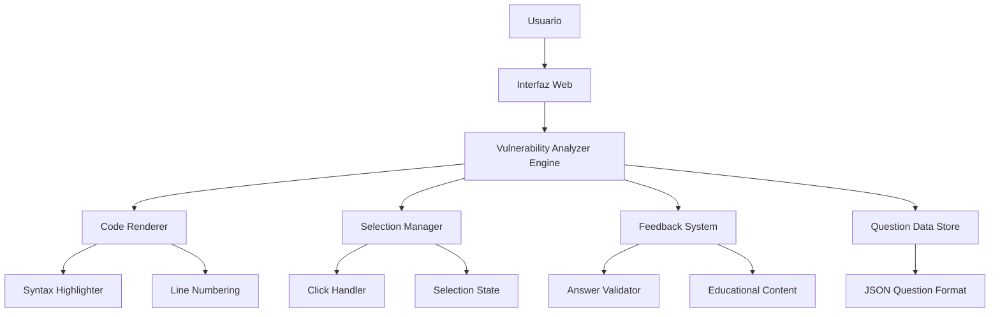

# Design Document: Vulnerability Code Analyzer

## Overview

El Analizador de Código de Vulnerabilidades es una aplicación web educativa interactiva que permite a estudiantes y profesionales de ciberseguridad estudiar vulnerabilidades de código mediante ejemplos prácticos. La aplicación presenta fragmentos de código con vulnerabilidades reales, permite a los usuarios seleccionar las líneas problemáticas, y proporciona retroalimentación educativa detallada.

La aplicación se integra con el quiz existente de seguridad de software, expandiendo las capacidades educativas desde preguntas teóricas hacia análisis práctico de código.

## Architecture

### High-Level Architecture



### Component Architecture

La aplicación sigue una arquitectura modular con separación clara de responsabilidades:

- **Presentation Layer**: HTML/CSS/JavaScript vanilla para máxima compatibilidad
- **Business Logic Layer**: Módulos JavaScript para manejo de estado y lógica de negocio
- **Data Layer**: Estructura JSON para preguntas y configuración

## Components and Interfaces

### 1. Code Renderer Component

**Responsabilidad**: Renderizar código fuente con sintaxis resaltada y numeración de líneas.

**Interface**:
```javascript
class CodeRenderer {
    constructor(containerId, options = {})
    
    // Renderiza código con sintaxis resaltada
    renderCode(code, language, lineNumbers = true)
    
    // Escapa caracteres HTML para seguridad
    escapeHtml(code)
    
    // Aplica resaltado de sintaxis usando highlight.js
    applySyntaxHighlighting(element, language)
}
```

**Supported Languages**: C, C++, Java, JavaScript, Python, PHP, SQL

### 2. Selection Manager Component

**Responsabilidad**: Manejar la selección interactiva de líneas de código.

**Interface**:
```javascript
class SelectionManager {
    constructor(codeContainer)
    
    // Habilita selección en líneas de código
    enableSelection()
    
    // Maneja clicks en líneas
    handleLineClick(lineNumber)
    
    // Obtiene líneas actualmente seleccionadas
    getSelectedLines()
    
    // Limpia todas las selecciones
    clearSelection()
    
    // Marca líneas como correctas/incorrectas
    highlightCorrectLines(lines)
    highlightIncorrectLines(lines)
}
```

### 3. Feedback System Component

**Responsabilidad**: Proporcionar retroalimentación educativa sobre las selecciones del usuario.

**Interface**:
```javascript
class FeedbackSystem {
    constructor(feedbackContainer)
    
    // Valida respuesta del usuario
    validateAnswer(selectedLines, correctLines)
    
    // Muestra retroalimentación de éxito
    showSuccessFeedback(vulnerability, explanation)
    
    // Muestra retroalimentación de error
    showErrorFeedback(selectedLines, correctLines, explanation)
    
    // Renderiza explicación detallada
    renderExplanation(vulnerabilityData)
}
```

### 4. Question Manager Component

**Responsabilidad**: Gestionar la carga y navegación entre preguntas.

**Interface**:
```javascript
class QuestionManager {
    constructor(questions)
    
    // Carga pregunta actual
    loadQuestion(index)
    
    // Navega a siguiente pregunta
    nextQuestion()
    
    // Navega a pregunta anterior
    previousQuestion()
    
    // Filtra preguntas por criterios
    filterQuestions(criteria)
    
    // Valida estructura de pregunta
    validateQuestion(question)
}
```

## Data Models

### Question Data Structure

```javascript
{
    id: number,
    title: string,
    language: string, // "c", "cpp", "java", "javascript", "python", "php", "sql"
    difficulty: string, // "basic", "intermediate", "advanced"
    category: string, // "sql-injection", "buffer-overflow", "xss", etc.
    context: string,
    code: string,
    vulnerableLines: number[], // Array de números de línea (1-indexed)
    vulnerabilityType: string,
    cweid: string, // CWE identifier
    owaspCategory: string, // OWASP Top 10 category
    question: string,
    explanation: {
        vulnerability: string,
        exploitation: string,
        mitigation: string,
        secureCode: string
    },
    references: string[],
    metadata: {
        author: string,
        dateCreated: string,
        lastModified: string,
        tags: string[]
    }
}
```

### Selection State Model

```javascript
{
    selectedLines: Set<number>,
    isAnswered: boolean,
    isCorrect: boolean,
    userAnswer: number[],
    correctAnswer: number[],
    feedback: {
        type: "success" | "error" | "partial",
        message: string,
        explanation: string
    }
}
```

### Application State Model

```javascript
{
    currentQuestionIndex: number,
    questions: Question[],
    filteredQuestions: Question[],
    userProgress: {
        completed: number[],
        correct: number[],
        incorrect: number[],
        categoryProgress: Map<string, ProgressData>
    },
    settings: {
        theme: "light" | "dark",
        fontSize: "small" | "medium" | "large",
        showLineNumbers: boolean,
        autoAdvance: boolean
    }
}
```

## Correctness Properties

*A property is a characteristic or behavior that should hold true across all valid executions of a system-essentially, a formal statement about what the system should do. Properties serve as the bridge between human-readable specifications and machine-verifiable correctness guarantees.*

### Property 1: Code Rendering Consistency
*For any* valid code fragment and supported language, rendering the code should produce syntax-highlighted output with proper line numbering and escaped HTML characters.
**Validates: Requirements 1.1, 1.2, 1.3, 1.5**

### Property 2: Selection State Management
*For any* line in a code block, clicking it should toggle its selection state, and the visual representation should accurately reflect the current selection state.
**Validates: Requirements 2.1, 2.2, 2.4**

### Property 3: Multiple Selection Support
*For any* set of non-consecutive lines, the system should allow selecting all of them simultaneously and maintain their selection state independently.
**Validates: Requirements 2.3**

### Property 4: Answer Validation Accuracy
*For any* user selection and correct answer set, the validation should correctly identify whether the selection is correct, partially correct, or incorrect.
**Validates: Requirements 3.1, 3.2, 3.3**

### Property 5: Question Data Integrity
*For any* valid question object, all required fields (code, language, vulnerableLines, explanation) should be present and consistent with each other.
**Validates: Requirements 4.2, 4.4, 4.5**

### Property 6: HTML Sanitization Security
*For any* code input containing HTML special characters, the system should escape them properly to prevent XSS attacks while preserving code readability.
**Validates: Requirements 7.1, 7.2**

### Property 7: Accessibility Compliance
*For any* interactive element in the interface, it should be navigable using keyboard-only input and provide appropriate ARIA labels for screen readers.
**Validates: Requirements 6.1, 6.2**

### Property 8: Cross-Browser Compatibility
*For any* supported browser (Chrome, Firefox, Safari, Edge), all functionality should work correctly without browser-specific code paths.
**Validates: Requirements 6.5**

### Property 9: Responsive Design Behavior
*For any* screen size, the code blocks should remain readable either through responsive scaling or horizontal scrolling when necessary.
**Validates: Requirements 6.4**

### Property 10: Progress Tracking Accuracy
*For any* completed question, the system should correctly update progress statistics for the appropriate vulnerability category and difficulty level.
**Validates: Requirements 5.4**

## Error Handling

### Input Validation Errors
- **Invalid Question Format**: Validate JSON structure and required fields
- **Missing Code Content**: Ensure code field is not empty
- **Invalid Line Numbers**: Verify vulnerable lines exist in the code
- **Unsupported Language**: Check language is in supported list

### Runtime Errors
- **Syntax Highlighting Failure**: Fallback to plain text display
- **Selection Handler Errors**: Graceful degradation with console logging
- **Network Errors**: Retry mechanism for external dependencies
- **Browser Compatibility Issues**: Feature detection and polyfills

### Security Errors
- **XSS Attempts**: Content Security Policy and input sanitization
- **Malicious Code Injection**: Server-side validation if applicable
- **CSRF Protection**: Token validation for state-changing operations

## Testing Strategy

### Unit Testing
- **Code Renderer**: Test syntax highlighting for each supported language
- **Selection Manager**: Test line selection, deselection, and state management
- **Feedback System**: Test answer validation logic with various input combinations
- **Question Manager**: Test question loading, navigation, and filtering

### Property-Based Testing
Each correctness property will be implemented as a property-based test with minimum 100 iterations:

- **Property 1**: Generate random code snippets and verify consistent rendering
- **Property 2**: Test selection toggling with random line numbers
- **Property 3**: Test multiple selection with random line combinations
- **Property 4**: Test answer validation with random selection patterns
- **Property 5**: Generate question objects and verify data integrity
- **Property 6**: Test HTML escaping with random special character combinations
- **Property 7**: Test keyboard navigation across all interactive elements
- **Property 8**: Cross-browser testing automation
- **Property 9**: Responsive testing across viewport sizes
- **Property 10**: Progress tracking with random question completion patterns

### Integration Testing
- **End-to-End Workflows**: Complete question answering cycles
- **Cross-Component Communication**: Verify proper data flow between components
- **External Dependencies**: Test highlight.js integration and fallbacks

### Accessibility Testing
- **Screen Reader Compatibility**: Test with NVDA, JAWS, VoiceOver
- **Keyboard Navigation**: Verify tab order and keyboard shortcuts
- **Color Contrast**: Automated testing for WCAG 2.1 AA compliance
- **Focus Management**: Ensure proper focus indicators and management

### Performance Testing
- **Large Code Blocks**: Test rendering performance with 1000+ line files
- **Multiple Questions**: Memory usage testing with 100+ questions loaded
- **Selection Performance**: Response time testing for rapid line selection
- **Syntax Highlighting**: Performance impact of highlight.js on various code sizes

The testing strategy ensures comprehensive coverage of both functional requirements and non-functional aspects like security, accessibility, and performance.